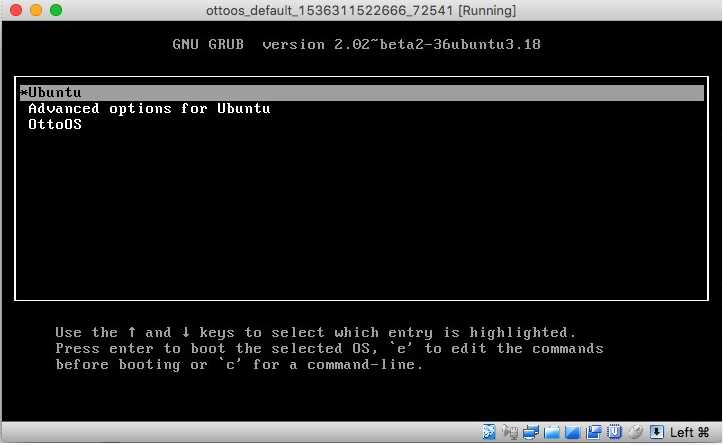
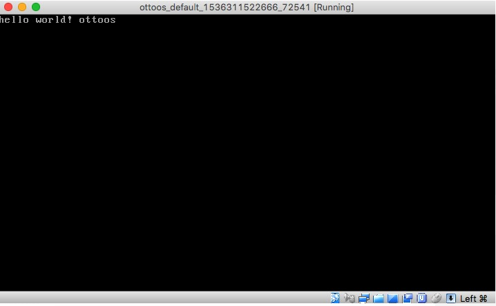

# OttoOS Toy OS kernel

This is a simple implementation of an kernel using as (gnu assembles) and c++.

## Dependencies

The kernel must be build on a linux machine (tested in ubuntu 16.04 xenial vagrant machine).

Install the dependencies:

    $ sudo apt-get install g++ binutils libc6-dev-i386

## Install and configure the kernel

to build and install the kernel (mykernel.bin)
    $ sudo make install

note: it will show some warnings but it should work

the kernel should be under /boot with name mykernel.bin

    ls /boot

## Add the grub entry for the kernel

    $ sudo vim /etc/grub.d/40_custom

add the following at the end of the file:

    menuentry 'OttoOS' {
        multiboot /boot/mykernel.bin
        boot
    }

apply the grub configuration

    sudo update-grub

Restart your machine and you should see the "OttoOS" entry 

